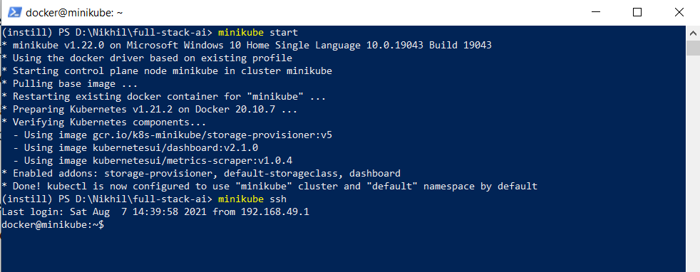
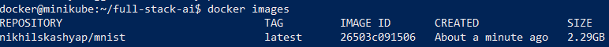
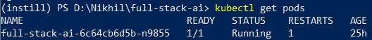
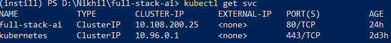
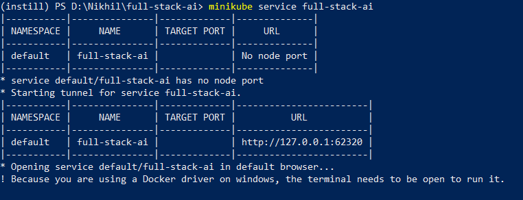
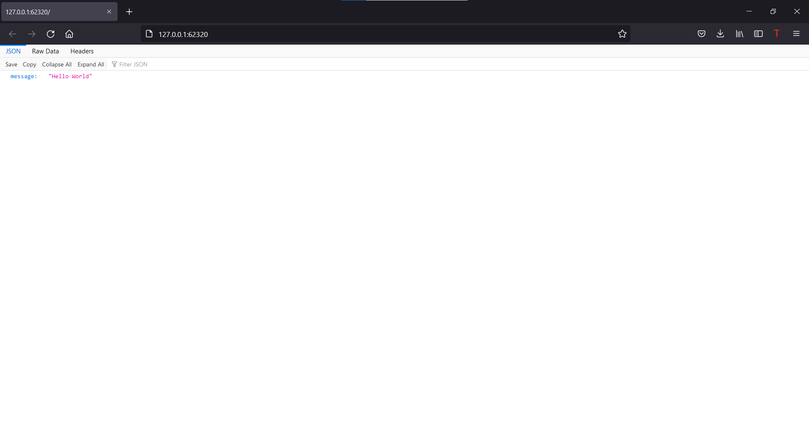
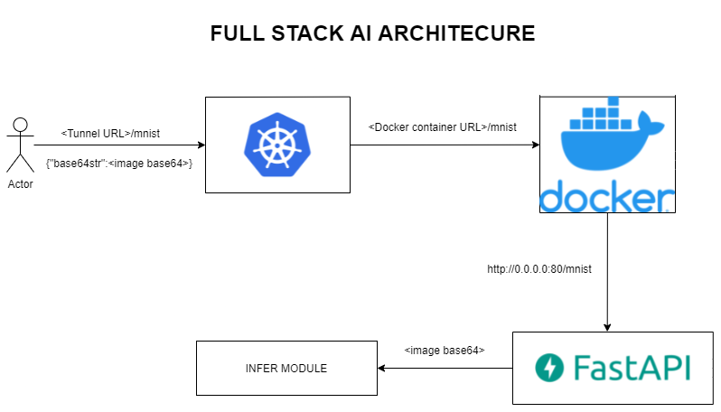

# Simple Vision-AI-as-a-service <!-- omit in toc -->

[Instill](https://instill.tech/) Full Stack AI Engineer assignment. 

## Problem Statement
The requirements and the provided sample codes serve a purpose to simulate a typical scenario when AI/ML engineers in a MLOps team pass a working deep learning model to a DevOps team to deploy it on production. We expect a Full Stack AI Engineer can independently handle this end-to-end development and deployment journey.

## Table of content <!-- omit in toc -->

- [Project Setup](#project-setup)
- [Architecture](#architecture)
- [Tasks](#tasks)
    1. [Prepare a MNIST deep learning model](#prepare-a-mnist-deep-learning-model)
    2. [Fine-tune FashionMNIST model](#fine-tune-fashionmnist-model)
    3. [Initiate a simple RESTful API backend server for hosting the model](#initiate-a-simple-restful-api-backend-server-for-hosting-the-model)
    4. [Containerise the backend server](#containerise-the-backend-server)
    5. [Set up a local Kubernetes cluster and deploy the service on it](#set-up-a-local-kubernetes-cluster-and-deploy-the-service-on-it) 

## Project Setup

Run the following comands to set-up this project. 

Start Minikube.

```
minikube start
```

Now ssh/log in to Minikube VM and create the docker image.

```
minikube ssh
```



Before creating the docker image, clone the repository containing the application’s source code inside minikube and cd into the folder.

```
git clone <repo http>
```

Assuming the repo name is full-stack-ai

```
cd full-stack-ai
```

Generate a docker image using the Dockerfile.

```
docker build -t <docker-hub id>/mnist:latest .
```

Check if the image was created with the command below.

```
docker images
```

You should get an output similar to this -



Log in to your [Docker Hub](https://hub.docker.com/) account from your terminal using the following command.

```
docker login
```

Now, the image can be pushed to Docker Hub. Replace <dockerhub_username> with your Docker Hub username.

```
docker push <dockerhub_username>/mnist:latest
```

Exit from the VM before doing the next step. 

```
exit
```

**Deployment**

To create the service and the deployment, we use the command below and deploy the application to Kubernetes.

```
kubectl apply -f manifest.yaml
```

You should get an output similar to this - 

```
service/flask-test-service created
deployment.apps/flask-test-app created
```

To check if everything is running we need to check the pods and the service.

```
kubectl get pods
```

You should get an output similar to this.



Checking the service.

```
kubectl get svc
```



Run this command to access the access the application thorugh tunnel URL. 

```
minikube service full-stack-ai
```



If the service is successfully deployed, you should be able to view "Hello World" message in your brower - 



You can view the deployment and pods on the Kubernetes dashboard

You can convert the image to base64 [here](https://codebeautify.org/image-to-base64-converter).

You can access the endpoint using cURL.

```
curl -X POST "<Tunnel URL>/mnist" \\
  --header "Content-Type: application/json" \\
  -d '{
    "base64": <image base64>      
  }'
```
## Architecture



This MVP consists of a **PyTorch** inference module, **FastAPI** as RESTful API for backend server, **Docker** for containerisation and deployed on a **Kubernetes Cluster**. 

## Tasks

### **1. Prepare a MNIST deep learning model.**


MNIST ("Modified National Institute of Standards and Technology") is the de facto “hello world” dataset of computer vision. Since its release in 1999, this classic dataset of handwritten images has served as the basis for benchmarking classification algorithms. As new machine learning techniques emerge, MNIST remains a reliable resource for researchers and learners alike. The MNIST database contains 60,000 training images and 10,000 testing images. The training and testing were downloaded from Pytorch Dataset [MNIST](https://pytorch.org/vision/stable/datasets.html#mnist). 

A trained model was downloaded from [here](https://artifacts.instill.tech/mnist_cnn.pt). You can find the inference script as `infer_mnist.py`.

### **2. Fine-tune FashionMNIST model.**

Similar to the MNIST problem, training and testing was downloaded from [FashionMNIST](https://pytorch.org/vision/stable/datasets.html#fashion-mnist) Pytorch Dataset. You can find the inference script as `infer_fmnist.py`.

You can find the training script as fashion_mnist.py. Hyperparms used to train the script are -
* `Training Batch Size` - 32
* `Testing Batch Size` - 32
* `Num of workers` - 4
* `Epochs` - 10
* `Learning Rate` - 0.001
* `Gamma` - 0.9
* `Optimizer` - Adam (performed better than AdaDelta)
* `Loss Function` - nll_loss 

Validation Accuracy was increased from 80% to `92%` with the above hyperparam configuration. 

**Future Experiments** - 

* Cross Entropy loss function can be used and observed against nll_loss. 

### **3. Initiate a simple RESTful API backend server for hosting the model.**

For this particular task, I used `FastAPI`. FastAPI is a modern, fast (high-performance), web framework for building APIs. FastAPI(`main.py`) in this project has been configured to use http://0.0.0.0:80 as `base URL`. http://0.0.0.0:80/mnist invokes `infer_mnist` script. http://0.0.0.0:80/fmnist invokes `infer_fmnist` script. 

**Advantages**
* `Fast`: Very high performance, on par with NodeJS and Go (thanks to Starlette and Pydantic)
* `Pythonic`: Minimal coding.
* One of the major drawbacks with `flask` is it has `no asysnc` support. Whereas, `FastAPI overcomes that challenge`. 

**Disadvantages**
* Handling requests validation with Pydantic is not straight forward. 

### **4. Containerise the backend server.**

I have used `Docker` to containarise the backend server. 

**Advantages**
* Major advantage of Docker is `portability across machines`.
* `Quick application deployment` - Containers include the minimal runtime requirements of the application, reducing their size and allowing them to be deployed quickly. 
* `Sharing` – you can use a remote repository to share your container with others.

**Disadvantages**
* With respect to this particular project, I did not find Docker working well with frontend. 
* Running as non-root was a problem. I could not run in WSL. 

### **5. Set up a local Kubernetes cluster and deploy the service on it**

I have set up a kubernetes cluster using `manifest.yaml` file, where docker can be deployed as a service. 

**Advantages**
* `VMWare of containers`. 
* `Multi-cloud support`. 
* `Easier monitoring with dashboard`. 

**Disadvantages**
* I found Kubernetes complex to run with docker-compose. 


